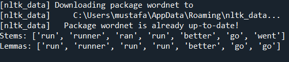

# NLP Stemming & Lemmatization 🌳

This repository demonstrates the fundamental text normalization techniques in Natural Language Processing (NLP): **Stemming** and **Lemmatization** using Python.

## 🧠 Concepts
While both techniques aim to reduce words to their base forms, they work differently:
- **Stemming:** A crude heuristic process that chops off the ends of words. It is fast but can sometimes result in non-words (e.g., it doesn't know that "ran" is the past tense of "run").
- **Lemmatization:** A more sophisticated approach that uses a vocabulary and morphological analysis of words. It returns the base or dictionary form of a word, known as the lemma (e.g., correctly converting "ran" and "went" to "run" and "go").

## 🛠️ Libraries Used
- `nltk` (Natural Language Toolkit)
  - `PorterStemmer`
  - `WordNetLemmatizer`

## 💻 Code Example
The script processes a list of words (`["running", "runner", "ran", "runs", "better", "go", "went"]`) through both a Stemmer and a Lemmatizer to highlight their differences in handling irregular verbs.

## 🖥️ Terminal Output
Here is the result of the script showing the clear difference between Stemming and Lemmatization outputs:

